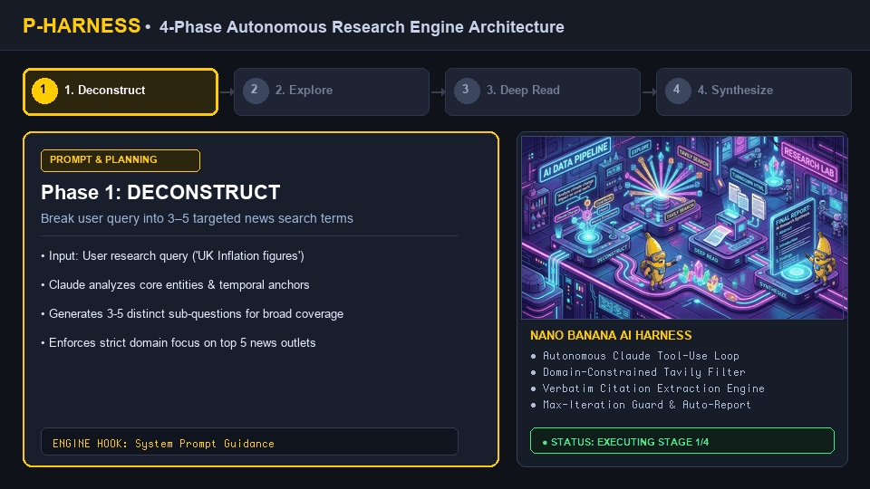
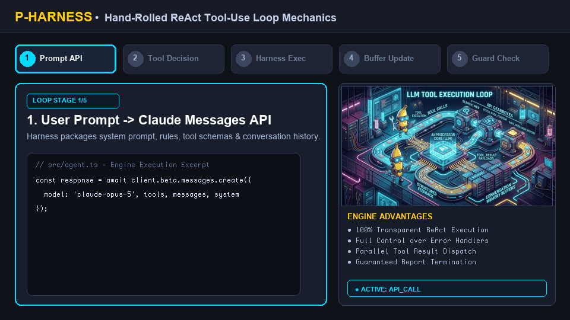
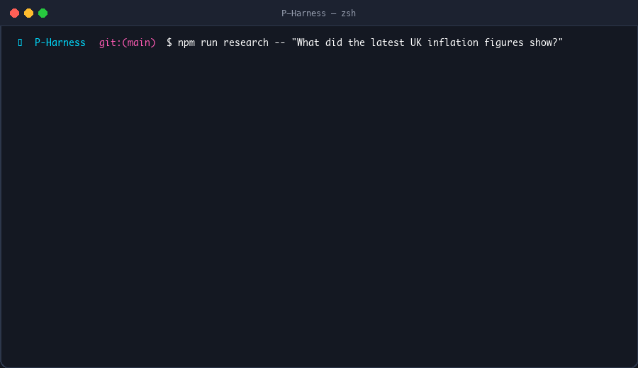

# 🍌 P-Harness Technical Architecture & Deep Dive

  

## Overview

**P-Harness** is an autonomous CLI research harness written in TypeScript. It is built to address common issues in autonomous agent design:
- **Hallucinations & Noise**: Constrained strictly to 5 verified journalism domains.
- **Surface-Level Reading**: Strict rule requiring deep HTML scraping ($\ge 3$ distinct sources) rather than relying on search engine snippets.
- **Black-Box Framework Bloat**: Replaced complex agent libraries with a clean, hand-rolled ReAct loop over the Anthropic Messages API.
- **Run Runaways & Premature Exits**: Deterministic iteration guards that guarantee report synthesis before token or iteration ceilings.

---

## 🎬 Animated Lifecycle

  

---

## 🧭 The 4-Phase Deterministic Pipeline

  

Defined in `src/prompts.ts`:

1. **Deconstruct**: Converts broad user questions into 3–5 targeted sub-queries.
2. **Explore (`search_web`)**: Queries Tavily API for candidates across `bbc.com`, `reuters.com`, `theguardian.com`, `npr.org`, and `apnews.com`.
3. **Deep Read (`fetch_page_content`)**: Downloads raw HTML, strips ads/scripts via Cheerio, converts to Markdown with Turndown, and extracts verbatim quotes.
4. **Synthesize (`save_research_report`)**: Structures Executive Summary, Key Findings, Breakdown, and Bibliography with verified inline markdown links.

---

## ⚙️ Hand-Rolled ReAct Loop Mechanics

  

  

In `src/agent.ts`:
- Batches parallel `tool_result` blocks into a single user message turn.
- Injects forced `tool_choice: { type: 'tool', name: 'save_research_report' }` on iteration `MAX_ITERATIONS - 1`.
- Exits early on disk save without unnecessary closing tokens.

---

## 🛡️ Curated Sources & Security

  

  

- **Allowed Outlets**: BBC, Reuters, The Guardian, NPR, AP News.
- **Credential Protection**: `scripts/pre-push-check.sh` prevents committing `.env` or secret tokens.
